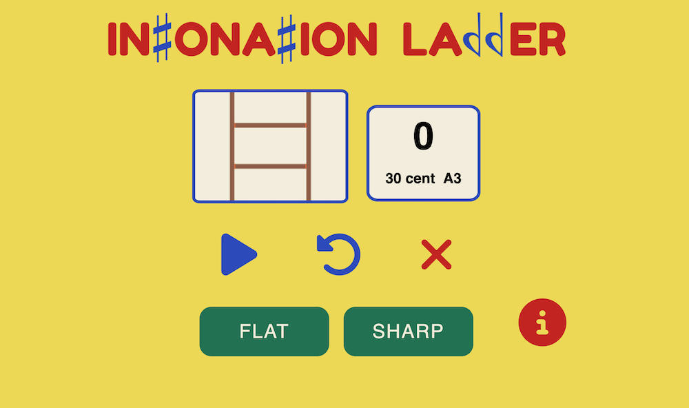
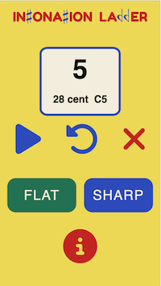
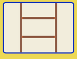
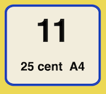
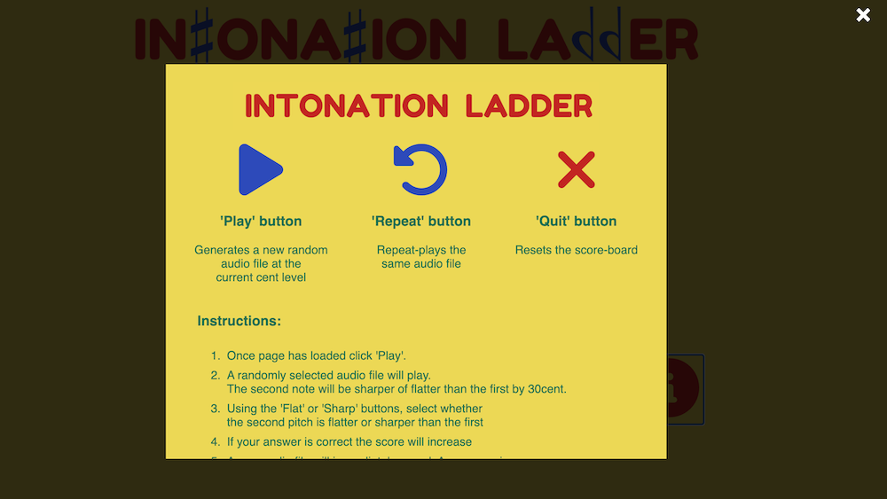
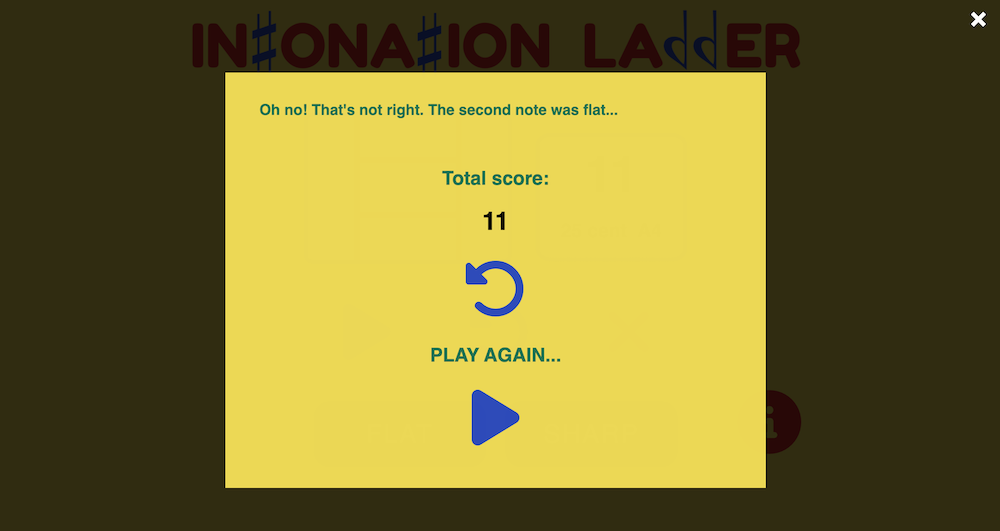

### View live site here

[**INTONATION LADDER**](https://sampetchey.github.io/intonationladder/)

## Site Goals

- Intonation Ladder is an ear training, music education game. Competence at comparing pitches is fundamental to the ability of a musician. Intonation Ladder measures how well a player can recognise a pitch that is slightly sharp or flat and helps them improve.

- Hearing intonation can help tune musical instruments, improve performance and rectify tuning issues. As the margin between pitches narrow, sharp or flat can be easily be mistaken. Ear training can make a significant difference at helping musicians in this area.

- Intonation Ladder uses a simple, interactive layout. Instructions and responses are intuitive and presented in a bright, positive design. An ascending ladder animation represents progression and success. Familiar icons guide the player into action or provide information and help when needed.

- Intonation Ladder contains 1000 pre-recorded audio files. Each one consists of two notes played on the piano, with the second note slightly sharper or flatter than the first. The audio files are selected at random and grouped into levels or 'cents'. 1 cent = 1/100 of a semitone. The game becomes progressively more difficult as a player's score increases. The maximum possible score is 100, with the last three questions containing pitches just 1 cent apart. 

- It is anticipated the site can be expanded by linking it to social media groups. Highscores could then be shared, creating group competitions and promotion of the site.

- Intonation Ladder would sit well alongside other ear training games in a music education website. It could be marketed to school music classes as a fun and effective way of improving listening skills.

- The site is responsive to all screen sizes. 

## User Experience (UX)

- ### User stories

- #### First Time Visitor Goals

  - A first time visitor will want to;

    - easily understand the objective of the game;

    - begin play immediately;

    - know their score and level;

    - be able to replay the audio to a question as many times as they like; 

    - reattempt the game easily;

    - be motivated by the design, colour and layout. 

- #### Returning and Frequent User Goals

  - A returning or frequent user will want;

    - Information and game rules hidden;

    - An immediate start;

    - To prove and record their progress;

- #### Using Intonation Ladder on a mobile device

  - The layout adapts to different screen sizes. Interactive 'flat' and 'sharp' buttons are positioned in the area of a player's thumb, keeping the score and progress info visible further up the screen.



## Design

### Logo


  The Intonation Ladder logo was designed using Canva. Its main font is 'Fredoka' interspaced with familiar sharp/flat music symbols replacing the 't's and 'b's. These were created using the 'Opus Plain Chords Std' font on Microsoft Word, exporting them as images and inserting them into the logo. 

  The name and logo is an important way a new user can quickly see and understand the purpose of the game. The two words 'intonation' and 'ladder', encapsulate all the game is designed to do, with the familiar sharp and flat symbols reinforcing the definition of the word 'intonation'.

### Colour scheme

  Intonation Ladder's color scheme was selected from various palette options provided on Canva. The bright scheme, based on primary colours, provides a distinctive and memorable brand in the style of a children's game. This helps the game feel encouragingly simple (despite a high score being rather difficult). Players feeling like this is a game rather than a test are more likely to keep playing and improve further.

### Structure

  The structure and layout of the site is deliberately simple. Beneath the logo is an image of a ladder, the game's symbol of progression, and a score board. Recognisable icons of play, repeat and cancel control the game. Player answer buttons are large, relatively close and at the bottom of the screen.

   

  Game information and instructions are hidden on load. The opening screen is intuitive enough for a player to work out immediately what they are to do. Where clarity or more information is required, the info icon opens a modal with information and instructions.



  A 'game over' page appears when a player makes the wrong answer. It shows the final score, enables a player to re-hear the audio they just got wrong and start another game.



## Programming Design

  With a simple visual layout, the complexity of Intonation Ladder lies in its underlying Javascript code. The programming logic can be broken into the following steps and functions:

  1. On page load:
    a.  Set score and cent level to 0.
    b.  Flat and Sharp buttons return 'null' as no audio has been played.
  2. When 'Play' is clicked:
    a.  Randomly generate an audio file.
      - The audio file is randomly generated using arrays of the file atributes.
      - For example: ```assets/audio/flat_21cent_E5.mp3```
      - The file attributes are Intonation: [sharp, flat], Cent (the game begins with the at 30) and the pitch e.g. 'A4'.
      - A pool of 9 pitches were recorded, both sharp and flat, at Cent levels 30-21; 25 at levels 20-11 and 12 at levels 10-1.
      - With this information the following arrays were written. Using arrays of file information simplifies the code. 
      - Alternatively, 1000 audio files could have been written into the code and it would have got very complicated.
      ```
      const levelOnePitchPool = ['A4', 'B3', 'C3', 'C5', 'D4', 'E3', 'E5', 'F4', 'G3'];
      const levelTwoPitchPool = ['A2', 'A3', 'B2', 'B4', 'C2', 'C4', 'D2', 'D3', 'D5', 'E2', 'E4', 'F2', 'F3', 'F5', 'G2', 'G4']
      const levelThreePitchPool = ['A3', 'A5', 'B2', 'B4', 'C4', 'D3', 'D5', 'E4', 'F3', 'F5', 'G2', 'G4'];
      const intonation = ['sharp', 'flat'];
      let cent = 30;
      ```
      - With these objects of arrays created, randomly selected properties can be inserted into the file name each time 'Play' is clicked. The file sounds immediately.
      ```
      function play() {
      let randomPitch = pitch[Math.floor(Math.random() * pitch.length)];
      document.getElementById("pitch").innerHTML = `${randomPitch}`console.log(randomPitch);randomIntonation = intonation[Math.floor(Math.random() * intonation.length)];
      console.log(randomIntonation);
      document.getElementById("audio").src = `assets/audio/${randomIntonation}_${cent}cent_${randomPitch}.mp3`;
      console.log(cent);
      audio.play();
      }
      ```
  3. When 'Repeat' is clicked:
    a.  The same audio file is sounded any number of times allowing players to listen more carefully.
    b.  Resounding happens immediately when 'Repeat' is clicked.
      ```
      function replayAudio() {
      audio.currentTime = 0;
      audio.play();
      }
      ```
  4. To answer, the player selects 'Flat' or 'Sharp'.
    a. The functions called by the button depends upon if it matches the randomIntonation value. 
    b. If correct, functions are called to increase the score, level and generate a new audio file.
    c. If incorrect, the gameOver() function is called:
      ```
      function answerFlat() {
        if (!randomIntonation) {
        return
      }
        if (randomIntonation === 'flat') {
        play();
        increase();
        pitch = audioPool();
      } else {
        gameOver();
      }
      }

      function answerSharp() {
      if (!randomIntonation) {
        return
      }
      if (randomIntonation === 'sharp') {
        play();
        increase();
        pitch = audioPool();
      } else {
        gameOver();
      }
      }

  5. With wach correct answer the score increases by 1. The cent level decreases, depending on the score. In this way, practice can target the key areas of practice between 20-10 cent. In the easier 30-21 cent section, just two questions/audio files are played per cent level. This helps he player progress more quickly. In addition, an ascending ladder animation is triggered, created using a 'bottom' to 'top' image transition over 2 seconds. When the score reaches 100, a congratulations alert celebrates the players achievement and encourages them to keep going with questions at just 1 cent.
  ```
  function increase() {
  score++;
  scoreBoard.textContent = score;
  ladder.classList.add("move-ladder");
  if (score === 2 || score === 4 || score === 6 || score === 8 || score === 10 ||
    score === 12 || score === 14 || score === 16 || score === 18 || score === 20 ||
    score === 25 || score === 30 || score === 35 || score === 40 || score === 45 ||
    score === 50 || score === 55 || score === 60 || score === 65 || score === 70 ||
    score === 73 || score === 76 || score === 79 || score === 82 || score === 85 ||
    score === 88 || score === 91 || score === 94 || score === 97) {
    --cent;
    document.getElementById("level").innerHTML = `${cent} cent`;
  } else if (score === 100) {
    alert("Congratulations! You achieved a perfect score of 100. Keep going, see how far you can go at 1 cent...");
    console.log("Congratulations! You achieved a perfect score of 100");
  }
  setTimeout(function () {
    ladder.classList.remove("move-ladder")
  }, 2000);
}
  ```
  6. When a player makes a wrong answer, a final score modal appears. Players can re-listen to the audio file they got wrong, using the 'repeat' button. Players can play again with a simple click of the play button.
  ```
  function gameOver() {
  document.getElementById("gameOver").style.display = "block";
  document.getElementById("correctAnswer").innerHTML = `Oh no! That's not right. The second note was ${randomIntonation}...`;
  document.getElementById("total").innerHTML = `${score}`;
  console.log(score);
}
  ```
  7. Additionally, without interrupting the game, a player can click the info button. A modal appears with detailed instructions.
  ```
  function openModal() {
  document.getElementById("infoModal").style.display = "block";
}
  ```

## Deployment

### GitHub Pages

The project was deployed to GitHub Pages using the following process;

1. The project was written in [GitPod](https://www.gitpod.io/) and pushed to GitHub Pages ready for deployment by taking the following steps;
1. Logged in to GitHub and located the [GitHub Repository](https://github.com/Readri205/MS2_Project);
1. At the top of the Repository, the "Settings" Button was selected on the menu;
   .
1. Scrolled down the Settings page until the "GitHub Pages" Section was located;
1. Under "Source", the dropdown showing "None" was selected and then "Master Branch" was chosen;
1. The selection was then saved and the page automatically refreshed; and
1. The published site is found by scrolling back down the page to the "GitHub Pages" section to find the live site - [**EARTH AFRICA** :earth_africa:](https://readri205.github.io/MS2_Project/).
   

### Forking the GitHub Repository

A copy of the GitHub Repository can be made by forking the GitHub account. This copy can be viewed and changes can be made to the copy without affecting the original repository. Take the following steps to fork the repository;

1. Log in to GitHub and locate the [GitHub Repository](https://github.com/Readri205/MS2_Project);
1. At the top of the Repository above the "Settings" Button on the menu, locate the "Fork" Button.
   ; and
1. Click to create a copy of the original repository in your own GitHub account.

### Making a Local Clone

1. Log in to **GitHub** and locate the [GitHub Repository](https://github.com/Readri205/MS2_Project)
1. Under the repository name, click "Code".
1. To clone the repository using HTTPS, click the top right hand link click "Use HTTPS";
1. Copy the link under "Clone with HTTPS";
   
1. Open your Code Editor and access the appropriate process to paste the clone link;
1. Change the current working directory to the location where you want to keep the cloned directory;
1. Paste the URL you copied in step 4 above.

Note that different Code Editors will have different processes for making the clone once the HTTPS link copy is made in step 4 above.


