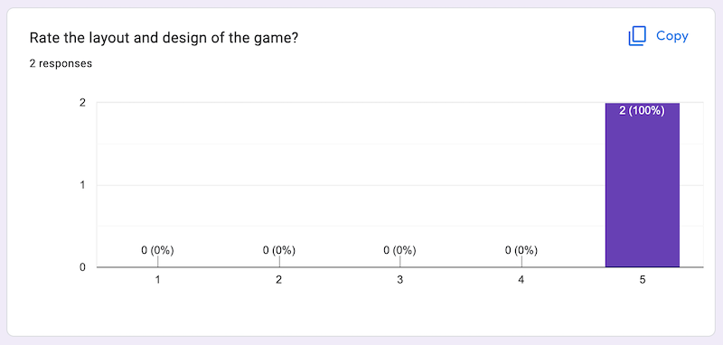

## User Experience Research

### Trial with Professional Musicians

1. On 6 Oct 2022, Intonation Ladder was shared with professional musicians from the British Army,  Band of the Welsh Guards to gain feedback. A Google form was provided for them to feedback their experience using the game, resulting in the following responses:

2. In addition to the Google form, many of the musicians gave verbal feedback. The game design, structure and content were all very positively received. The objectives of helping improve aural ability appear to be well met.

3. A suggestion for further improvement was to vary the sound type. Instead of just piano, to switch to brass or woodwind type sounds. This could be achieved with audio recordings using these sounds and simple buttons for players to choose what sound they would like to hear the quesion played with.

### HTML, CSS and Javascript Validators

No issues have been detected from online HTML, CSS and JAVASCRIPT validators:

[Link to Lighthouse HTML validator](https://web.dev/measure/)

[Link to css validator](https://jigsaw.w3.org/css-validator/)

[Link to jshint](https://jshint.com/)

## Bugs

1. There are no known bugs following testing performed thus far.

2. One improvment might be for the colour of player buttons not to remain changed when touched on a mobile.
